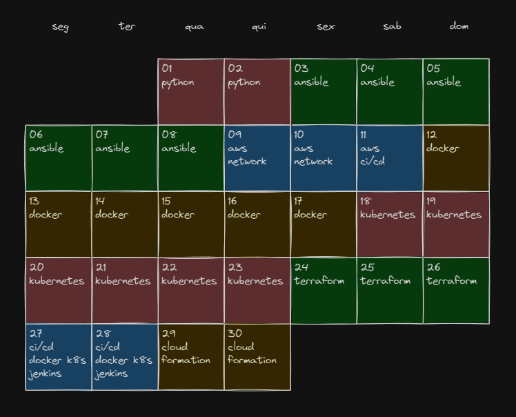
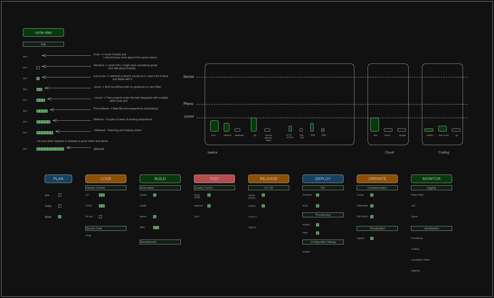
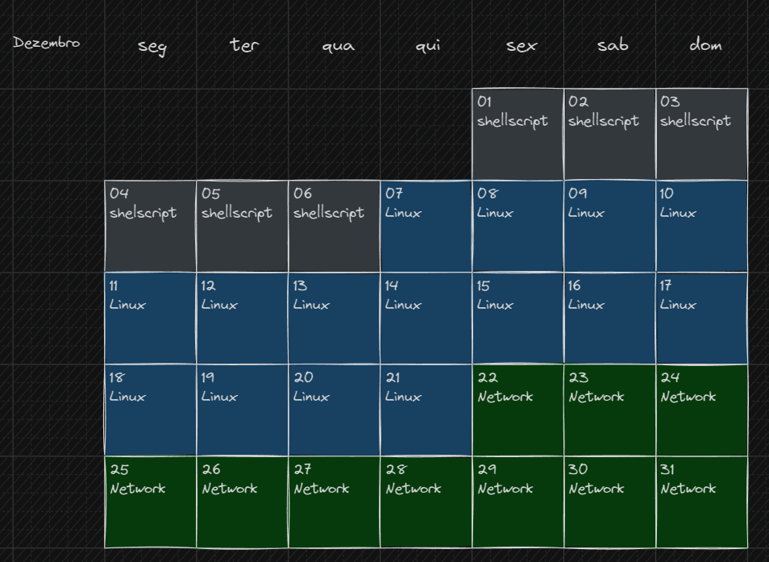

# diario de bordo

## The Return

### Making my way back into tech after a 15 year hiatus.

#### 01/01/23 -> pesquisa sobre programação

#### 07/01/23 -> python

#### 14/01/23 -> comecei a focar em frontend, html+css+js

#### 01/02/23 -> total foco em JS, intermediary to advanced

#### 20/02/23 -> react and other frontend stuff (tailwind, git, libs)

#### 15/04/23 -> typescript

#### 05/05/23 -> ultimo commit git, dei um tempo...

## The Re-Return

 
Apos quase 4 meses afastado do retorno, aqui vem o re-retorno, em nova modalidade, ouvi falar
dessa tal de cloud e devops.
FIquei curioso e vou começar a pesquisar do que se trata pois nem sei realmente o que faz direito.
Passar uns dias tentando entender esse novo universo.
  

#### 23/08/23 -> pesquisa sobre devops, cloud, certificados... (yt)

#### 26/08/23 -> brief intro linux/bash (yt)

#### 29/08/23 -> brief intro network (yt)

#### 01/09/23 -> brief intro cloud/aws (yt)

#### 07/09/23 -> brief intro devops (automation, docker, kubernetes) (yt)

#### 13/09/23 -> foco no certificado SAA aws (deadline 13/12/23) (skillbuilder, aws whitepapers, yt and a bit of udemy)

#### 12/10/23 -> cantrill no reddit me deu o toque de ir mais devagar com aws e abrir mais o leque por enquanto. 

## ONE YEAR TO GET JOB READY ON THE CLOUD

### Beginning of the journal 13rd of Octorber 2023

#### [ [ 13 / 10 / 2023 ] ] -> Started studying DevOps directly, the goal now is to get a broad idea of the enviroment and how I will aproach this first basic contact.

#### 15/10/23 -> Started a new course, more focused on DevOps (53h Imran Teli), the biggest reason to change direction was the necessity of acquiring better understanding of the devops basics [I MUST FINISH THIS ONE!!]

#### 17/10/23 -> So many bugs with vagrant (local virtualization), though Im starting to feel the very first signs of understanding Devops culture and automation, quite subtle though.

#### 21/10/23 -> finished the first part of the Devops course, it was about the basis of the workload, lots of traditional virtualization, linux, bash (missed on more networking but I already done a small youtube course on it, 20 or so hours on it).

#### 22/10/23 -> Learning how to include AWS into the mix, replacing on-premise "servers" and even other services with cloud power. Great feeling to be reaching this point to finally make the connection between the cloud and devops practices. (Before this course I was studying only cloud without any real understanding of operations/linux/network)

#### 23/10/23 -> Starting the Jenkins section of the course, it is the longes section of the whole course (6h), Imran does not fuck around, he is a straigh shooter and those 6 hours are of pure content and knowledge, this will be specially a wild ride since I was really looking forward to learn Jenkins cause there is something I like about automation and it looks like Jenkins would be the first actual taste of it.

#### 24/10/23 -> 2 days of intense CI/CD studies, it was actually my first formal contact with the concept(I had heard of it, but never actually had my hands on it), the tool Imran chooses is Jenkins ( I am aware there are many other options available ).

I am still half way through the CI/CD section and I did face a bit of a learning curve in order to get the bigger picture, a few particular new concepts were quite challenging to fully comprehend, but the little I could grasp was very exciting and motivating.

#### 25/10/23 -> Done with first half of the studying section (Jenkins), and with taht finished

26/10/23 -> Due to some burnout from the Jenkins section, I ended up spending the day halfassing, I had the material out but ended up just trying to solve some bugs I had with jenkins+ECS (aws) and a generalized SSH issue. It was basically a day off. no focus and no discipline.

27/10/23 -> Infelizmente comecei o dia colocando umas horas mas logo me abati e procurei reorganizar meu schedule pois Manu esta querendo comecar um trabalho novo.
Horarios bem mais estritos e agora todo dia preciso definir o que vai ser estudado no dia seguinte!

[[28/10/23]]

Objetives:

1. Do a revision of the jenkins section
2. Fix bug that prevented the ECS/jenkins work
3. finish Jenkins section

I could get a lot of study in, but a bit unfocused, it was guided at a high level by the Jenkins material but ended up going everywhere around the subject.

**[[29/10/23]]**

Planning: Finish revision (Docker part specially)
Execution: Done! And even better, could fix the bug with ECS/Jenkins as well!
The revision overall was very beneficial, I went over the jenkins section too quickly and now Im glad I got so many bugs in the section project, that forced me to go back and redo most of the section and I actually expanded the research a lil bit.

**[[30/10/23]]**

Planning: Finish Jenkins section.
Execution: took me a while to go over Jenkins using master and slave concepts, but once I did understand it was very revealing, the power of jenkins is really impressive.
Also there was one very good section on security with Jenkins, many good options but I liked role based permissions for overall utilization.

This ends the Jenkins section, hell of a ride, now I do feel like I got a decent understand of the basics of what it's done in a CI enviroment, prob I will have to learn another tool like github actions, but Jenkins really spoke to me in a way, its ungly, clunky and complicated but so versatile and powerfull, the security of jenkins may be the only deal breaker at this point, it does concern me a bit how we have to leave on the server few hardcoded stuff .

**[[31/10/23]]** 
Planning: Research about Ansible, get my feet wet.  
Execution: I did some the research but it was quick, and I ended up following the course pre-estabilished order and I will be doing the Python part (I was a bot reclunctant on spending the time on it at this point). Very simple language and alreayd went through half of it.  

## November

**[[01/11/23]]** 
Planning: Finish videos from Python section, maybe write some practice code (related to devops/automation)  
Execution:

Comments
I ended up finishing the python section but didnt really practice it, it was quite a quick intro to python and I will be seeing it again in the future. So what I really spent my day on was Ansible, boy am I sold on it. I did watch some lectures but I was leaned more on free research, jsut to get an overall grasp of the tool and what it solves.

  

**[[02/11/23]]** 
Planning: Go hard at Ansible  
Execution: oh boy I did, very much so!

Comments
Followed a lot of video lectures and some decent ammount of documentation reading, not a lot of practice though. I am a bit tired and got a bit ahead of myself, so I guess before finishing the last hour of the ansible section I will take some time off to watch a few "related" videos. I am feeling like following someones project and maybe trying to get a very small project myself would be very beneficial at this point. I am ahead of schedule and do have the available time for it, I just need to make sure this side quest includes Ansible.

  

**[[03/11/23]]** 
Planning: Take it easy and check some related material/projects with ansible  
Execution: Wander a lot around the devops world then smashed ansible section.

Comments
A bit of checking devops videos, more related to concepts and culturem this was fun but not really practical, I guess it does help with getting confortable with some tech terms.
Then I tried to watch a few "projects tutorials" but I had a difficult time from the get got, since they all did something with Docker / Terraform within the first 5 minutes. Techs I havent really understood fully.
After feeling like I waste a lot of time I went back to the course and finished the rest of Ansible section, even though it was for only 2 days, I actually took a lot of new concepts even a quick glace (20 mins class) at IaC in the cloud using aws, seems like Terraform is the actual current tool for provisioning infra in the cloud, Ansible is still good tho for configuring all the infra, so I should see a lot of Ansible in my future.

  

**[[04/11/23]]** 
Planning: AWS networking concepts  
Execution: A lot of repeated content, I thought it would be something different. Plew throught it though.
  

**[[05/11/23]]** 
Planning: Finish AWS networking review, finish as well next section, which goes over a AWS CI/CD services  
Execution: Weak day, only 3 hours. Really tired of CI/CD and AWS (I need switching to keep interested, that was the reason to learn devops hehe)
  

**[[06/11/23]]** 
Planning: Docker (maybe try a different angle)
 
Execution: I tried a diffenret tutor and hated it, got real confused with Docker, this is real new territory.
  

**[[07/11/23]]** 
Planning: Linux (from roadmap.sh)
 
Execution: A lot of reading about Linux concepts, specially about processes and storage.
  

**[[08/11/23]]** 
Planning: Linux and shell scripting
 
Execution: actual shell scripting hands on, lots of documentation reading
  

**[[09/11/23]]** 
Planning: Docker / Linux
 
Execution: Could actually do a lot of the course, it was clarifyin and I feel some improvement in Docker understanding.
  

**[[10/11/23]]** 
Planning: kubernetes
 
Execution: did nothing, HUGE L in the day, woke up real late and just couldnt study at all. Just a very tiny bit of Docker revision.
  

**[[11/11/23]]** 
Planning: Docker
 
Execution: I got a lot done, full docker focus, read a lot of docs as well (did the whoel gettin started from the official docs). I still feel like I need more practice on docker, I really want to get this down so it smooths out the kubernetes transition.
  

**[[12/11/23]]** 
Planning: Docker (maybe kubernetes)
 
Execution: Got a bit of Docker in, not much tho, enough to complete the 60 weekly hour goal for the first time.
  

**[[13/11/23]]** 
Planning: Docker (maybe swarm/k8s) or focus on kodekloud new platform (cause its free for now, so I really should enjoy for now)
 
Execution: Turns out the platform wasn't free, so I just dug my head into kubernetes really, Imrans course bugged out so I started following kodeklouds youtube free kubernetes course/labs.
  

**[[14/11/23]]** 
Planning: Kubernetes (kodekloud)
 
Execution: went hard on kubernetes, trying to build a good base, not taking any shortcuts on it, Ill study trying to build stuff along with every new concept, will need a lot of practice in the beginning to make at least the base super clearly understood.
  

**[[15/11/23]]** 
Planning: kubernetes (chill a bit), try different sources and a high level understanding.
 
Execution: Checked a few channles ended up gettin back to Imrans course, I MUST FINISH IT!!(after finishing I already have 10 following plans, but just focus on the course, the gola was just to have a better understanding of devops, not getting good at it right now) I also got a few issues re-installing kOps to create k8s clusters, I need to work on my patience when facing bugs. Anyways, went back later solved it and could get few good hours in.
  

**[[16/11/23]]** 
Planning:kubernetes
 
Execution: Not very effient honestly, facing a lot of bugs with kops for creating and managing clusters. The actual Imrans course I accomplished only a single 15 minutes class. My understanding of kubernetes is coming up for sure but very veyr very slowly... I may be too eager, not even a week of kubernetes.
  

**[[17/11/23]]** 
Planning:Kubernetes (Imrans course + hands on)
 
Execution: Docker and kubernetes!
Well, changed completelly the day, but I think it was fruitfull. I did a long review on Docker, even dockerized an old react app of mine. I really feel like I needed that to help me with kubernetes, even though I was doing some low level Docker stuff the help comes as a better high level of the whole cycle with docker and kubernetes. So it was good practice and it may be the beggining of a full project that I need to do by the end of Imrans course, I will need to get this app react repo with a ci/cd with infra from terraform and ansible, then dockerizing it and throwing into a kubernetes cluster.
  

**[[18/11/23]]** 
Planning: Kubernetes (Imrans course + hands on)
 
Execution: I completed a few more lectures of kubernetes, but I keep coming back to older lectures, making sure I get a good basis, so Ive been doiing a lot of practicing extra research, basically for every 1 hour of lecture it takes 20 more hours of research and practice. I will end the kubernetes section with a decent understanding of the very basics because I do pretend to build a lot more on top of it.
  

**[[19/11/23]]** 
Planning: Kubernetes (Imrans course + hands on)
 
Execution: Kept on trying to make k8s services run after midnigth. During the day I spent with family, I was only one hour from my weekly objecive and at night I completed the hour with some research on k8s network.
  

**[[20/11/23]]** 
Planning: Kubernetes (Imrans course + hands on) - doing what i missed from yesterday.
 
Execution: didnt put that much time in and I am still lcoked up trying to run my app in kubernetes, so I went back into docker to fix the image, so right now Im basically getting practice with docker and kubernetes, actual hands on.
  

**[[21/11/23]]** 
Planning: docker + kubernetes hands on practice.
 
Execution: Completed a week on k8s so I sprinted a bit to complete it. Got deep into k8s but not with complete understanding, I went a bit through the motions on the k8s project, i just dont feel like I have enough k8s knowledge yet. This def must be reviewed for at least another week. K8s is done and I already initiated 2 new sections, terraform and gitops.
  

**[[22/11/23]]** 
Planning: Terraform (prefereably finish it in 2 days, I only need a overview for now)
 
Execution: Well I finished it in a single day, terraform is not as simple, there is a lot of "coding" in it. I could understand most of it, almost 95% and thats why I could go through it real fast, I just think to actually get good at it I will need to put a lot of practice time in it. Although I did enjoy it and I wanted to spend more time on it right now I wont, I have to remind myself constantly that it is only a ovewview for now.
  

**[[23/11/23]]** 
Planning: Finish Gitops section or at least 2 sections at most.
 
Execution: Finished gitops section and the other last two section of the course. The last 2 sections were kinda old using Jenkins (which I do not think Ill focus any energy on) and the other very last section was on aws cloudformation (IAC which people do not use directly), so I went over it real fast and I may return (specially to the GitOps section becuase it used an architecture very interesting) with terraform, kubernetes, git actions.
Finished Imrans course, I do feel I learn a lot but at the same tim I feel like I was introduced to a lot of new contents and ideas, now I need to sif through it and pick a few to get good at it.
Now there is only a month left in the year, I will organize it to try and get as much as I can in, but the content will for sure be focused on my basic tech gaps; network, linux, servers, protocols... so next year I can focus on deep diving specific techs. (k8s, cloud, terraform, helm, shell scripting/python)

I also spent a bit drawing a skill map so I can figure the areas I am lacking

 

## December

#### [ [ 24/11/2023 ] ]

#### Planning ---> Nginx Mastery youtube -> 7 hours ( https://www.youtube.com/watch?v=GlCloo47p_E&list=PLOLrQ9Pn6cawvMA5JjhzoQrnKbYGYQqx1&index=3 )

#### Execution ---> I did some decent ammount of nginx study, the tutorial I picked up to follow ended up being a lot of nginx running on docker, which grabbed a lot of my attention, so I ended up leaning towards doing docker stuff. I liked it and I think this si the way to go forward, but right now I really should focus more on more basic stuff, basics aer very important for me, I really need to be good at linux most of all

 

#### [ [ 25/11/2023 ] ]

#### Planning ---> Moms bday, prob won't study at all

#### Execution ---> well yep, exaclty that, didn touch the computer at all... it will complete 48h without no studying, so I guess I really should go tonite...

 

#### [ [ 26/11/2023 ] ]

#### Planning ---> Plan out the last few days of november and start having a skecth of what dcember will look like

#### Execution ---> I ended up just spending the whole weekend with family, it was great but now I will need to make up for it. Next week will be 60 hours week (with focus and discipline)!

 

#### [ [ 27 / 11 / 2023 ] ] 

#### Planning ---> Focus on organizing what I will actually study and make sure it is a chanlenging goal for the week.

**A list of a few deeper gaps at this moment.** 
-> databases - I know the whats, whys, hows... but I need more techinical skill, like the ability to spin up DB servers (VMs and containers) and connecting them to other services (VMs and containers). At the very least 1 DB hands on set up, but 2 would be very nice (3 is the ideal, this knowledge/experience is just that important) 
suggestion: MySQL, PostgreSQL, Redis.
-> SSL / TLS - don't even know exactly what it is, something to do with security, get a grasp on the higher level concepts. 
-> DNS - I knwo a bit and can pass by, but Im in nee of more direct contato with it (lil of psychological bareer), I just need a few videos to feel a bit more inside. 
-> Linux - even though I could clearly use a lot more knowledge about the whole Linux universe, I firtly should focus on the scripting part. Especially automation, here I could use a couple of actual projects as well.

#### Execution ---> I got a very brief quick review of Databases but I dropped it, I know I need the basis knowledge but I will focus on the employable skills, people need to nkow linux and shell script, its just a MUST, its basically the number one skill for jobs in SRE/Devops world. So i bought a shell script udemy course, -> Linux Shell Scripting: A Project-Based Approach to Learning Now I now I can finish a difcult course, I will try to build on it. I will do it and practice it as much as I think I should. Try to have fun with this.

#### [ [ 28 / 11 / 2023 ] ]

#### Planning ---> Work on shell script cousrse

#### Execution ---> I am so tired...from surf really. When there is a swell it gets very hard to put as many hours in. But I did get a good ammount, I like the subject, I am learning script but also a lot about linux administration at the same time, I actually have been feeling like I need to go deeper into linux sysadmin stuff, but I dont think it shold be focused. Also I will estabilish a crazy dead line for the rest of this course. I need to finish it quickly and maybe get a quick project of my authorship in.

 

#### [ [ 29/11/2023 ] ]

#### Planning ---> Shell script udemy -> finish sections 4, 5 of shell script course

#### Execution ---> Unfortunately I could not find myself today, just did a bad job overall, no focus and I did not follow the actual guide, tried to come up with my own rules for the final exercise of section 4. Got stuck and basically couldn't put any more value time in.

 

#### [ [ 30/11/2023 ] ]

#### Planning ---> Finish section 4 and start on section 5.. Total focus and energy on doing the exercise of 5, that is the most important part of the lesson.

#### Execution ---> Finished both sections and even started on section 6. Today was a great day, could get a lot of time in, stayed with my daughter a good ammoutn of time as well and the time I spent studying was actually very effective.

 

## December

#### [ [ 01/12/2023 ] ]

#### Planning ---> Draw the plan for december and finish section 6 of the shell script course.

#### Execution ---> The plan is done but open to major modifications, I also could get a bit done for section 6 of the shellscript couse (there was a bug in the cloud that delayed me). DId not do the last exercise so it will be done tomorrow, I had already forseen this possibility.

 

#### [ [ 02/12/2023 ] ]

#### Planning ---> Do section 6 exercise shellscript. (timeleft can be used to begin next sections or work o decembers plan/research)

#### Execution ---> I did put a lot of work and could finish the exercise, it was over 100 lines script and Im really happy with the result even though it took me a couple of days to finish. Many hours spent on it, did revisions on the stuff also, I feel some real improvement.

 

#### [ [ 03/12/2023 ] ]

#### Planning ---> Shell sctip course. Quick review of section 6 and on to at the very least finish section 7.

#### Execution ---> Kind a took the day off really, it is a sunday and my daughter is sick, kinda spet most of the time with her.

 

#### [ [ 04/12/2023 ] ]

#### Planning ---> same objective of yesterday.

#### Execution ---> Another day with short studying sessions, I wore the dad helmet all day long. I could get a few bits and pieces in but it was spread very thin along the day. Still is something tho and I do love spending the day with my baby. Tomorrow I must finish the shell course, it is delayed already.

 

#### [ [ 05/12/2023 ] ]

#### Planning ---> Finish shellscript course. Start a 2 week linux self bootcamp, planning on follow linuxjourney.com with auxiliary videos from a devops dude focused on linux sysadmin.

https://www.youtube.com/playlist?list=PLtK75qxsQaMLZSo7KL-PmiRarU7hrpnwK

#### Execution ---> I finished the shellscript course (again finishing bad, skimming over the very last section), starting something is so easy... finishing it is the real challenge, I am glad I could finish the last 2 ones, I must be serious about this whole thing. I realy enjoy it, particularly how different and diversified the knowledge is. I did not study that much, but it was effective.

 

#### [ [ 06/12/2023 ] ]

#### Planning ---> Focus on Linux admin, the plan is to keep working on linuxjourney website. I could of course make use of side research (docs or even youtube videos)

#### Execution ---> I done pretty much what I was supposed to, not too amazing tho...in my book not goot enough, its gots to bes uhhhmazinh!

 

#### [ [ 07/12/2023 ] ]

#### Planning ---> Keep on focusing on linux, I do need a lot more work, at this point I need to incorpporate some networking, even tho those are 2 different fields (linux and network) they both can be worked together.

#### Execution ---> Finished the linuxjourney.com content and quickly extended the research and went over some DNS study (it was the last section of the linuxjourney)... I have been planning on going way deeped into DNS, in reality all I knew about it was from side quests, I never actually took the time to read into it. One and halg session later I alreadu feel like a lot of progression was made, at least at the highest level I feel like I can talkj about the subject

 

#### [ [ 08/12/2023 ] ]

#### Planning ---> Dig into DNS and then learn more about linux networking (if there is time)

#### Execution ---> I got a couple of decent sessions, found out about DNSSec which i didnt know about it, it was a very complicated subject that spilled over into some securtiy/network aspects (authorization, hash, digital certificates...) so i just went down the rabbit hole. Although I wasnt as dedicated as I should be I still learned new stuff.

 

#### [ [ 09/12/2023 ] ]

#### Planning ---> Today there will be a lot of social life activities, probably wont get much done, but the time I do get in I should dedicate it to Linux. (I feel like Im leanin towards some project doing, I actually may be not just ready for this but it could be in my best interest at this point)

#### Execution ---> As I though, did not get any real technical work, I just spent the day with family and friends, attended 3 different events in the same day. There is no reason to despair tho, just keep on trucking, no need to worry about making up for it, need to live with a balance between work and family.

 

#### [ [ 10/12/2023 ] ]

#### Planning ---> The monthly plan tells me to go for linux studies, but I do think I could use a project or 2, I may just do that honestly. Since its sunday ill be a lil more lenient.

#### Execution ---> I couldnt get a lot done, actually almost nothing done, at most 1 hour of refreshing memory of jenkins.

 

#### [ [ 11/12/2023 ] ]

#### Planning ---> Practice what I already studied. (aws, jenkins...)

#### Execution ---> I got a bit of actual exercise, it is a reality check, we may be able to follow very complex instructions but once wwe are left to our own that whole picture changes dramatically. Its good tho, I had to get to this crossroad someday, the sooner the better, lets get it done!

 

#### [ [ 12/12/2023 ] ]

#### Planning ---> More exercising, objective today is to get at least a simple react app up and running on a ec2 running nginx. (by myself), from there we will slowly turn up the exercise dificulty (ex: next one could be a 2 tier setup with nginx and mysql)

#### Execution ---> Amazing day, got a lot of experience and hands on job. The evolution is very slow but i can see how getting stuck can teach us a lot, I am still doing the basics of devops but I am walking with my own feet. I got a react app running on nginx installed on a EC2 virtual machine.

 

#### [ [ 13/12/2023 ] ]

#### Planning ---> Investigate how i could automate the project with nginx and react.

#### Execution ---> I didnt do much, I just couldnt focus, I ended up just chilling with family.

 

#### [ [ 14/12/2023 ] ]

#### Planning ---> Do the jenkins course of Nana

#### Execution ---> I could get a bit done, but need way more, its diffcult to admit but I have been slacking, this is not a good thing, I must keep focus, I am now getting close to be employable, the certification will come, be patient and stay 100% focused.

 

#### [ [ 15/12/2023 ] ]

#### Planning ---> Nana course (jenkins), no need to go too deep, but this is spaced repetition strategy, i've studied jenkins a month or so ago, now time to get some recolection and at the same time build more repos on git to show off some 'projects'

#### Execution ---> very productive day, feel like a learned a bunch, I focused and even tho it wasnt a crazy number of hours studying those hours were efficient. Great review of jenkins, it is totally necessary.

 

#### [ [ 16/12/2023 ] ]

#### Planning ---> Jenkins from nanas, time to crank it up.

#### Execution ---> I did put my time, but got tangled up in some installation and dockerizing stuff, ended up not watching much from the course, but this is good, I feel like untangling shit is one of the core principles of devops therefore all practice is welcomed.

 

#### [ [ 17/12/2023 ] ]

#### Planning ---> Keep on doing the same, watch nanas when you can but focus on actual hands on stuff. Just put the 10k hours in. It is invalueable.

#### Execution ---> I spent the day with my daughter, its near the end of the year and I think it's hitting me a bit, I feel the feels... So I didnt do much, Ill make it up during the week(hopefully).

 

#### [ [ 18/12/2023 ] ]

#### Planning ---> work on some projects with docker and jenkins, then watch a bit more of nanas course

#### Execution ---> BREAKING NEWS, another unexpected obstacle, a big ass remodeling in the apartament directly underneath us, this whole week will be used for removing the whole apartaments floor, so I just cant tank the noise, it is prettu loud. I went to my moms and there it was a whole another shit... fact is I did not study at all... again.

 

#### [ [ 19/12/2023 ] ]

#### Planning ---> Well, now im almost a week late in my half month schedule, so I will still try to actually do my jenkins review with nanas course

#### Execution ---> Still going through the reform downstairs, so I couldnt stay home, but I did get some study during early hours, finished jenkins stuff. Now Ill be going for a different review or even a project.

 

#### [ [ 20/12/2023 ] ]

#### Planning ---> It was supposed to be k8s, but I went for docker, I still need better fundamentals with docker to really get going with k8s

#### Execution ---> I did spent a decent ammount of time on docker but I got stuck in a few bugs with node + docker, I found out that apparently node shuts down its container because of a bug within pid1 in linux, must investigate further.

 

#### [ [ 21/12/2023 ] ]

#### Planning ---> Docker, no guilt trip. Helsinki University docker course (on my own time)

#### Execution ---> I guess that being a lil easier on myself paid dividends, got a lot of knowledge and even some new stuff about docker, this course is really great and I am enjoying, I really think the best type of course is well ellaborated and up to date writte text book style lessons.

 

#### [ [ 22/12/2023 ] ]

#### Planning ---> More docker. Helsinki University (docker basics)

#### Execution ---> Today was a good day, got some quality time and streamed everythong, I also did the last optional exercise, and otmorrow ill be working on the mandatory ones which are supposed to be more challenging

 

#### [ [ 23/12/2023 ] ]

#### Planning ---> More docker. Helsinki University (mandatory exercises)

#### Execution ---> I did not put any time in it today, I had to think about it to understand what happened, I just wasted lots of time on trying to make the stream work, so I really should take that into account frmo now on.

 

#### [ [ 24/12/2023 ] ]

#### Planning ---> I must finish the exercises from Docker Helsinkis university.

#### Execution ---> Success, I finished the first mandatory question, fully understood everything involved in it as well. GOod sessions and I am happy with the results.

 

#### [ [ 25/12/2023 ] ]

#### Planning ---> Spend the day mostly with family, although get a couple of hours in if you can, show some extra focus and consistency could make wonders for my self confidence.

#### Execution ---> Surprisingly enough I got some juice out of the end of the day, quite tired and half assing but I did some studying and ended up finishing a exercise. Now I only one more so we can go for the next docker section.

 

#### [ [ 26/12/2023 ] ]

#### Planning ---> More docker, helsinkis university!

#### Execution ---> Finished the first part, fianlly, kinda got stuff on the last exercise but finally finished it. I got 2 good sessions in the day and I do feel like I upgrade my docker skills specially creating images which can be quite complicated.

 

#### [ [ 27/12/2023 ] ]

#### Planning ---> Start the second part of the hellsinki university.

#### Execution ---> Great study session, did get a lot of learning in and also took some more direct beginner steps towards finding a job. Lots opf hours and good pick uo form an atypical low hours daily ration month. December has been slow in the actual study end, but I am already about to complete 4 months and still very motivated and feeling like I will be ready to get started on studying for certifications.

 

#### [ [ 28/12/2023 ] ]

#### Planning ---> Keep on doing the docker helsinkis course, best case scenario get to at least the last section of the second part (docker compose / network)

#### Execution ---> Mission accomplished (kinda), I did get to the last exercises but I did zero progress in them, I also got very little studying time. I also went surfing with no swell, I should not, specially after a good swell over the weekend. 

 

#### [ [ 29/12/2023 ] ]

#### Planning ---> Keep working on docker helsinki, but remember I can mix things up whenever I get too stuck on something (be from borendom or inability to do some exercise)

#### Execution ---> I invested a lot of hours, but with very little progress, these exercises are no joke, it took me half the day to solve one. I do feel like I am gettin close to real experience tho, just learning about it docker was not really cutting it.

 

#### [ [ 30/12/2023 ] ]

#### Planning ---> Helsinki docker, today I MUST finish the second part, no excuses.

#### Execution ---> Few hours in but not much progress, still stuck in the 2.9 exercise. The reality is that I did not focus as much as I could and should.

 

#### [ [ 31/12/2023 ] ]

#### Planning ---> Try and get at least one exercise finished. Thats all I can ask for right now, the very last day of the year.

#### Execution ---> I was able to get some lil bit of study, but not very efficient to be honest, this whole month of december was a bit weak, but 2024 will be the year ill become at least good at devops.

 

#### [ [ 01/01/2024 ] ]

#### Planning ---> I will take the first day of the year ot reassess and organize, plan a bit of the year and a little more detailed plan for january and even more details for this week.

#### Execution ---> Not enough hours, but I did get some of my planning drawn, I decided to dedicate 2024 to my professional life, that is the main focus but I will also have to sidehustle with uber, it is decided, and my family will have to take the impact of my absence, but I must remind myself of the endgoal here and also not forget who I am doing this for.

 

#### [ [ 02/01/2024 ] ]

#### Planning ---> Some complementary planning for the week schedule and hands on devops reviews with AWS reassembly.

#### Execution ---> Almost the whole day spent on just docker really, I love docker and I think it's important to get good at it, its almost like one of those base techs that serves as building step for a lot more advanced stuff. Its clearly very powerfull by itself but being good at it for surte it will help me a lot undesratanding more complex tools and techs. 

 

#### [ [ 03/01/2024 ] ]

#### Planning ---> AWS (studying root53 right now with stephane) and some other complementary tech (could be kubernetes)

#### Execution ---> Most of the day was on aws but the aws study was compromised by my anxiety since I actually got a job interview, so that made it difficult to focus on aws studies, I also spent some time preparing for the interview but I could still get a bit of aws in.

 

#### [ [ 04/01/2024 ] ]

#### Planning ---> AWS (well architect and strat on s3 ) / the secondary task is for job interview and hunt

#### Execution ---> Good day, got a lot of time studying no top of a half decent interview (lots of practice needed here), I am working on some skillbuilder stuff just to warm um my way backj into aws stuff, me like it!

 

#### [ [ 05/01/2024 ] ]

#### Planning ---> Work on the game development with AWS badge / extra time can be used for linkeding networking

#### Execution ---> This is an awesome day, got a ton of content in, and really re sparckle my aws love, actually now I feel like I can not only understand everything wayyyy easier, I also am able to apreciate the actual good and innovation aws and cloud tech offer the industry, its just marvelous.

 

#### [ [ 06/01/2024 ] ]

#### Planning ---> 10 am kuberenet with linux tips / AWS during the rest of the day

#### Execution ---> Well, the week was going great and today I messed up, and yeah, it was 100% my fault, I know I cant play games for only a couple of hours... so I basically spent my whole 'computer' time playing a silly game... I did watch the k8s class, but I really didnt learn jack.

 

#### [ [ 07/01/2024 ] ]

#### Planning ---> Finish game development with AWS badge

#### Execution ---> I could finish the section but I just didnt feel like I could do the test, just didnt learn deep enough the content. From now on I will jsut focus on my test really.

 

#### [ [ 08/01/2024 ] ]

#### Planning ---> Sections 12 to 15 (2h 40m). This whole week will be a crazy netflix marreks videos week, focus on just watching the whole content, do not need to reaserch anything.  

#### Execution ---> Done, every single section done with only half the available time dedicated to it, I kind watched everything real quick, now the focus is to cover the whole content quickly so I can get to the test and then be able to review my weakest subjects and study particular questions taht I felt like I had to.

 

#### [ [ 09/01/2024 ] ]

#### Planning ---> Sections 16 to 18 (3h 14m).

#### Execution ---> Another objetcive completed. What makes the day special is that I actually got my secondary quest done as well, finished the security intro course from fortinet, its very basic but its a good introduction to cyber security and it offers a free certification (still need to finish 2 more courses to get the cert, I guess ill be doing a module a week as secoindary quests for the week. The main quest of course is AWS SSA certi) 

 

#### [ [ 10/01/2024 ] ]

#### Planning ---> Sections 19 to 23 (3h 16m). This is a very challenging day, long hours of these sections on a surf day.

#### Execution ---> Done, it was well enough, lot of concepts and lots of tools, mostly I had heard of it before but some new info about each of them, def will need a review on some, specially the data analysis areas wich are kind of a foreign concept to me, def my weakest aspect are related stuff to big data and data bases. Overall a good day Id say.

 

#### [ [ 11/01/2024 ] ]

#### Planning ---> Sections 24 to 26 (3h 36m).

#### Execution ---> fail today, I just couldnt take in any longer, my sleeping schedule is making so much more difficult to understand the concepts... surfing also made me very tired and maybe maybe maybe that may help me take control of my sleeping schedule. So right now I am late on the course, today I may even take a quikc surfing trip, that might leave me even further behind... gotta pay attention to that... just take it back man. tomorrow is a day off... so I really got to do this.. just do my best!!

 

#### [ [ 12/01/2024 ] ]

#### Planning ---> Sections 27 to 28 (3h 19m).

#### Execution ---> I just couldnt finish it, very tired for 2 reasons, lack of sleep and too much surfing (there is an epic swell right now at my spot, I cant miss it, as long as I do my work stuff tho). So I couldnt finish what I had to do unfortunatelly, I did most of it but not all of it, now I will have to work in my day off, which would it tomorrow. no bueno.

 
## [ [ 13/01/2024 ] ]

#### Planning ---> day off // no more day off, now I will try to get my side quest done (k8s study for class tomorrow morning) and a few more lecture from maareks ssa course, so that way there is time left sunday for a practice test (only with this result I can organize nexts week study schedule)

#### Execution --->  super special day, dont even care that I didnt study hahahaha, i wont leave mention in this diary why today is special, but I didnt study at all (i watched the k8s class but very lightly )I spent the day with my family

 

#### [ [ 14/01/2024 ] ]

#### Planning ---> Sections 29 to 33 (1h 43m).

#### Execution ---> Done! finito! amzing work if i say so myself! Well, finish as well the test so now I can focus nexts week studys, so good man, I am def pumped. (although the result of this practice test was a 57)

 

#### [ [ 15/01/2024 ] ]

#### Planning ---> ( 13 questions goal ) Plan the whole week out and get hands dirty immediatly // mid day update: after accessing the results of the practice test, i decided to review every single question (correct and incorrect ones) and on top of reading the tests feedback I will be doing some extended research, just letting my curiosity guide a little bit here, so I will be doing at least 13 questions a day, so I can be done AT MOST by friday.

#### Execution ---> Well, I studied and review a few first questions, I went a bit too deep in some of the subjects and may have wasted too much time, but then I had an unexpected thing to get done and had to drop the studyings way earlier. I WILL have to make up for this time or wont be able to accomplish my goals, finally I only completed 8 out of minimum of 13 I should finish.

 

#### [ [ 16/01/2024 ] ]

#### Planning ---> ( 26 questions goal ) Go hard on my questions review. thats it!

####  Execution ---> I did it, congrats to me, 30 questions reviewed out of the 26  I should have, mission accomplished even better than thought it would. Many hours of study all based on the test questions, got actually quite a few questions ahead of schedule. I feel good.

 
#### [ [ 17/01/2024 ] ]

#### Planning ---> ( 39 questions goal ) Keep it moving, do not lose focus now that we are ahead of schedule, goal for the day is 39 questions revised at the very least! I am enjoying reviewing questions a lot, it's a very good mix of subjects which it helps me avoiding boredom.

#### Execution ---> Finished them all, i actually got to 49 questions. A bit tired but this is the game, get to it till I cant fuckin learn, this is a brain gym right there! Keep it up mfkr!! I can feel I understanding everything better, there is still a long way to go tho.

 
#### [ [ 18/01/2024 ] ]

#### Planning ---> ( 52 questions goal ) The object is almost reached already, so I might actually work a bit on another test (not planned), or just work a secondary quest.

#### Execution ---> Very good job, a bit rushy by the final 10 questions or so, but I did finish them all and already did another test... decent result, better grade than the last one, got it up to 61%, great news. So now I can move to some of secondary quests before going for reviewing question ( one thing tho, I am thinking of dropping the k8s course saturday mnorning, I just cant keep up with it right now, must focus on aws theory and projects with aws)

 
#### [ [ 19/01/2024 ] ]

#### Planning ---> ( 65 questions )  - already finish all questions! Then I can spend half the day on projects and a half on aws (correction of the practice exam) 

#### Execution ---> Well I tried to work a project but I decided to actually do a very simple architecture with aws using terraform, it is just something I cant not avoid, the project might be simple but using IAC is necessary. I did some of the work and could study some aws as well.

 
#### [ [ 20/01/2024 ] ]

#### Planning ---> AWS, I might actually focus on skillbuilder for a bit (instead of working with maarek) 

#### Execution ---> I had to do the k8s course, that messed me up cause IM not really paying attention to it and at the same time couldnt do well the aws study, also it was not for a long time, but it was quality study although a bit too narrow (only IAM policies subject)

 
#### [ [ 21/01/2024 ] ]  
#### ANNOUNCMENT -> DAY FOR THE TEST IS DECIDED 29/02/24 
to be able to do it tho I must have scored at leasa 90 in the second round of maareks practice exams and passed on most of dojos exams
also, new suggestions for a study strategy for these last 30 days, I should alocate some daily time for at very least go over at least 1h a day for maareks videos, this time could expand to 2 hour MAX, and then the time left in the day for study should be around the same subjects, just focus a single day on a small area.

#### Planning ---> Finish the IAM deep dive and start on working at correcting and reviewing subjects from the last practice exame I've done.

#### Execution ---> 

 
#### [ [ 22/01/2024 ] ]

#### Planning ---> Completelly forgot todays task, godamn it // I remember later, every monday I am supposed to take a mock test.

#### Execution ---> I did take the practice exam (got a 72%), also organized a lot of stuff and planned the path to certification.

 
#### [ [ 23/01/2024 ] ]

#### Planning ---> Review questions from mondays test, then read a bit on the subjects i feel weaker.

#### Execution ---> 

 
#### [ [ 24/01/2024 ] ]

#### Planning --->

#### Execution ---> 

 
#### [ [ 25/01/2024 ] ]

#### Planning --->

#### Execution ---> 

 

